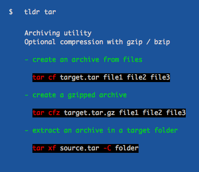

# tldr

[tldr](https://github.com/tldr-pages/tldr) is a collection of simplified and community-driven man pages.

New to the command-line world? Or just a little rusty? Or perhaps you can't always remember the arguments to lsof, or tar?

Maybe it doesn't help that the first option explained in man tar is:

```
-b blocksize
   Specify the block size, in 512-byte records, for tape drive I/O.
   As a rule, this argument is only needed when reading from or writing to tape drives,
   and usually not even then as the default block size of 20 records (10240 bytes) is very common.
```

Surely people could benefit from simplified "show me the common usages" man pages. What about:

